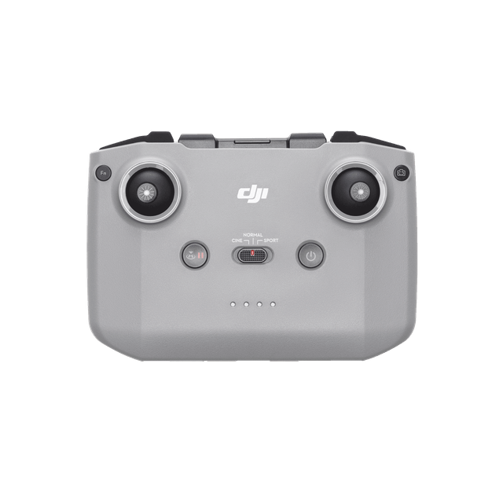

DJI RC-N1(or N3) as GamePad
===============

This is a program that connects to your DJI Drone Remote Controller (RC-N1 or N3) as a normal win gamepad for PC games,
reads the stick positions and tells Windows that position.



-----------------------------------------------------------------------------
## Installation / Usage
- Install packages before usage:
- dji-assistant-2-consumer-drones-series and close it after installation https://www.dji.com/downloads/softwares/dji-assistant-2-consumer-drones-series
- python 3.9 or 3.x

``` bash
pip3 install vgamepad
pip3 install pyserial
pip3 install pydirectinput
```

- Power on RC-N1(or N3)
- Connect via bottom type-C
- run main.py
- run game


-----------------------------------------------------------------------------
## Notice
- Only tested for Minecraft. For the other games you should change the variables.
- Change raw input setting. It is in the mouse control settings in Minecraft.

## Citations
- https://github.com/IvanYaky/DJI_RC-N1_SIMULATOR_FLY_DCL
-  https://github.com/learncodebygaming/pydirectinput
